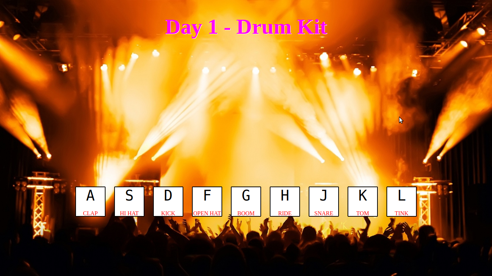
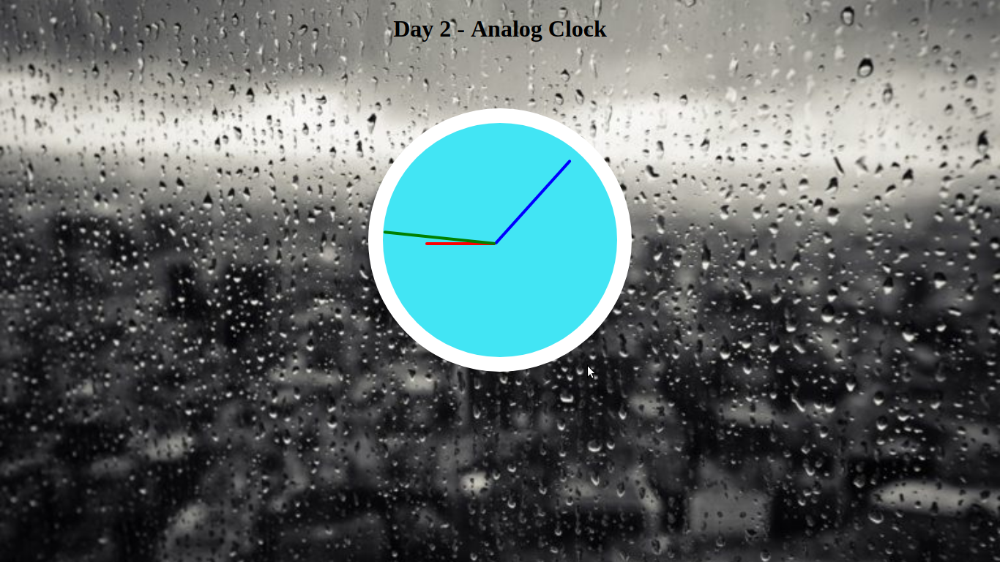
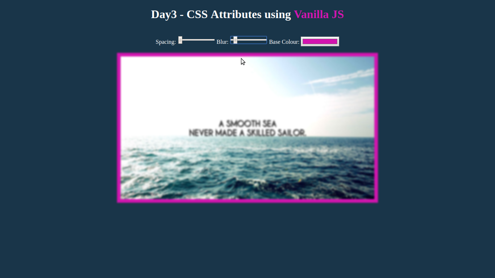
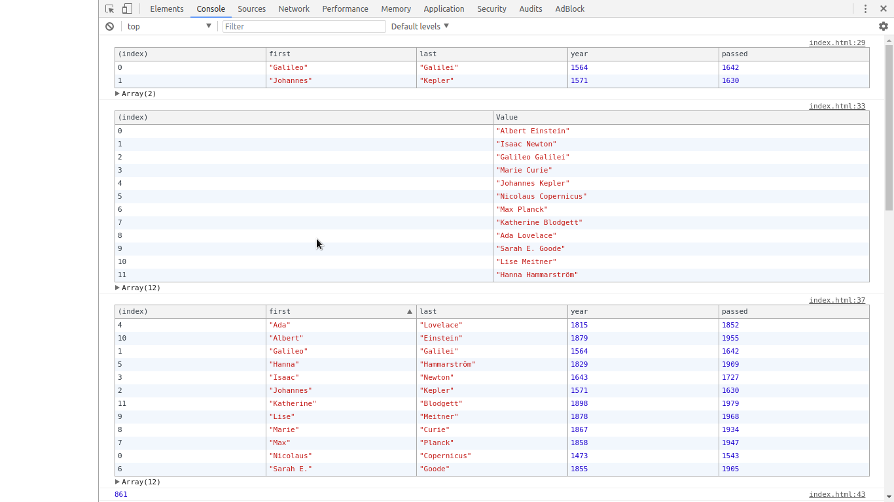
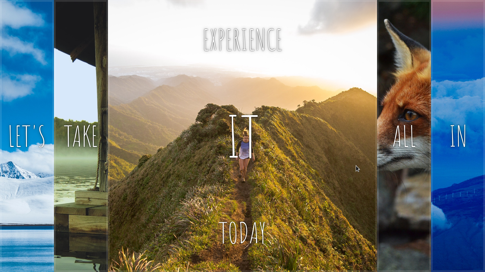
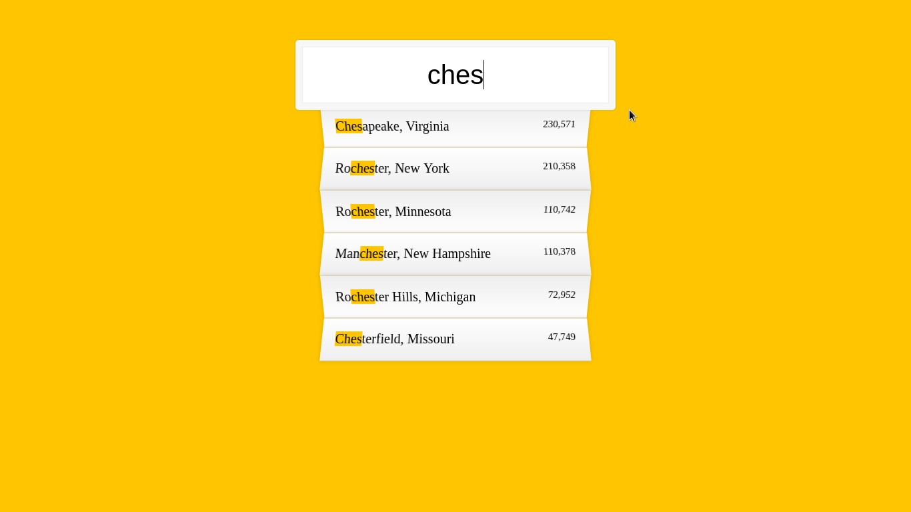
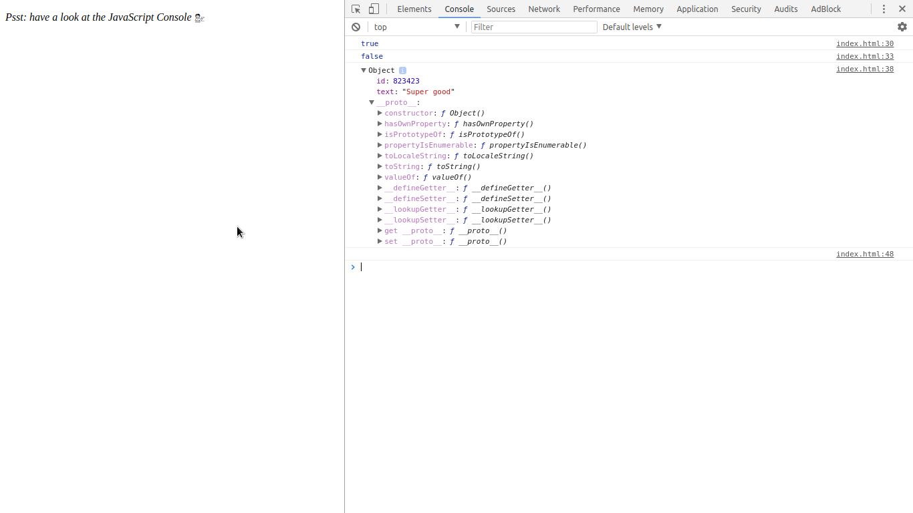
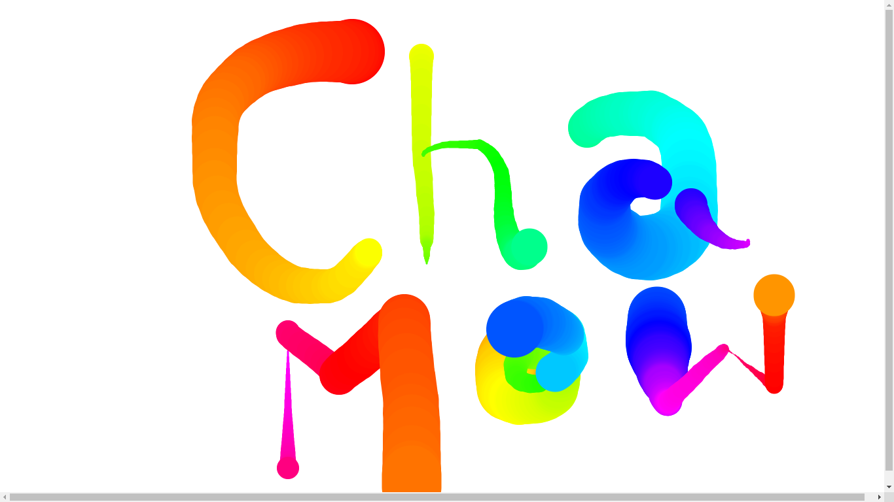

	<h1>Vanilla JS 30 Day Challenge</h1>
	
This repository contains my submission of 30 day Vanilla JS Challenge by Wes Bos.

	 
	<h2>Day 1 - Drum Kit</h2>
	 
	<h4>Screenshot</h4>
	
	 
	<h4>Working</h4>
	Go to <a href="https://chamow97.github.io/Vanilla-JavaScript-30-Day/Day1/" target="_blank">https://chamow97.github.io/Vanilla-JavaScript-30-Day/Day1/</a> to see its working :)
	 
	 
	<h2>Day 2 - Analog Clock</h2>
	 
	<h4>Screenshot</h4>
	
	 
	<h4>Working</h4>
	Go to <a target="_blank" href="https://chamow97.github.io/Vanilla-JavaScript-30-Day/Day2/">https://chamow97.github.io/Vanilla-JavaScript-30-Day/Day2/</a> to see its working :)
	 
	 
	<h2>Day 3 - Playing with CSS variables and JS</h2>
	 
	<h4>Screenshot</h4>
	
	 
	<h4>Working</h4>
	Go to <a target="_blank" href="https://chamow97.github.io/Vanilla-JavaScript-30-Day/Day3/">https://chamow97.github.io/Vanilla-JavaScript-30-Day/Day3/</a> to see its working :)
	 
	 
	<h2>Day 4 - Array Cardio Day 1</h2>
	 
	<h4>Screenshot</h4>
	
	 
	 
	<h2>Day 5 - Flex Panels Image Gallery</h2>
	 
	<h4>Screenshot</h4>
	
	 
	<h4>Working</h4>
	Go to <a target="_blank" href="https://chamow97.github.io/Vanilla-JavaScript-30-Day/Day5/">https://chamow97.github.io/Vanilla-JavaScript-30-Day/Day5/</a> to see its working :)
	 
	<h2>Day 6 - Ajax Type Ahead</h2>
	 
	<h4>Screenshot</h4>
	
	 
	<h4>Working</h4>
	Go to <a target="_blank" href="https://chamow97.github.io/Vanilla-JavaScript-30-Day/Day6/">https://chamow97.github.io/Vanilla-JavaScript-30-Day/Day6/</a> to see its working :)
	 
	<h2>Day 7 - Array Cardio Day - 2</h2>
	 
	<h4>Screenshot</h4>
	
	 
	<h2>Day 8 - Fun with HTML 5 Canvas</h2>
	 
	<h4>Screenshot</h4>
	
	 
	<h4>Working</h4>
	Go to <a target="_blank" href="https://chamow97.github.io/Vanilla-JavaScript-30-Day/Day8s/">https://chamow97.github.io/Vanilla-JavaScript-30-Day/Day8/</a> to see its working :)
	 

