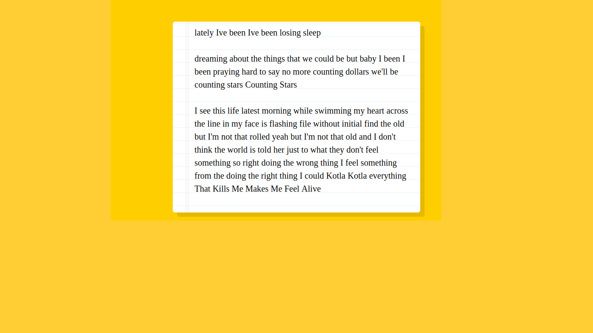
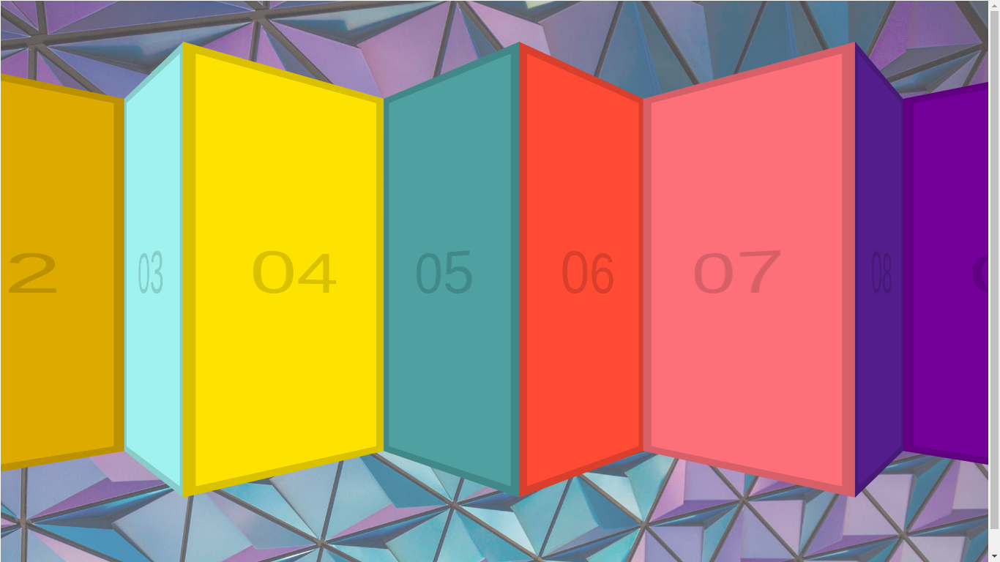

	<h1>Vanilla JS 30 Day Challenge</h1>
	
This repository contains my submission of 30 day Vanilla JS Challenge by Wes Bos.

	 
	<h2>Day 1 - Drum Kit</h2>
	 
	<h4>Screenshot</h4>
	
	 
	<h4>Working</h4>
	Go to <a href="https://chamow97.github.io/Vanilla-JavaScript-30-Day/Day-1/" target="_blank">https://chamow97.github.io/Vanilla-JavaScript-30-Day/Day-1/</a> to see its working :)
	 
	 
	<h2>Day 2 - Analog Clock</h2>
	 
	<h4>Screenshot</h4>
	
	 
	<h4>Working</h4>
	Go to <a target="_blank" href="https://chamow97.github.io/Vanilla-JavaScript-30-Day/Day-2/">https://chamow97.github.io/Vanilla-JavaScript-30-Day/Day-2/</a> to see its working :)
	 
	 
	<h2>Day 3 - Playing with CSS variables and JS</h2>
	 
	<h4>Screenshot</h4>
	
	 
	<h4>Working</h4>
	Go to <a target="_blank" href="https://chamow97.github.io/Vanilla-JavaScript-30-Day/Day-3/">https://chamow97.github.io/Vanilla-JavaScript-30-Day/Day-3/</a> to see its working :)
	 
	 
	<h2>Day 4 - Array Cardio Day 1</h2>
	 
	<h4>Screenshot</h4>
	
	 
	 
	<h2>Day 5 - Flex Panels Image Gallery</h2>
	 
	<h4>Screenshot</h4>
	
	 
	<h4>Working</h4>
	Go to <a target="_blank" href="https://chamow97.github.io/Vanilla-JavaScript-30-Day/Day-5/">https://chamow97.github.io/Vanilla-JavaScript-30-Day/Day-5/</a> to see its working :)
	 
	<h2>Day 6 - Ajax Type Ahead</h2>
	 
	<h4>Screenshot</h4>
	
	 
	<h4>Working</h4>
	Go to <a target="_blank" href="https://chamow97.github.io/Vanilla-JavaScript-30-Day/Day-6/">https://chamow97.github.io/Vanilla-JavaScript-30-Day/Day-6/</a> to see its working :)
	 
	<h2>Day 7 - Array Cardio Day - 2</h2>
	 
	<h4>Screenshot</h4>
	
	 
	<h2>Day 8 - Fun with HTML 5 Canvas</h2>
	 
	<h4>Screenshot</h4>
	
	 
	<h4>Working</h4>
	Go to <a target="_blank" href="https://chamow97.github.io/Vanilla-JavaScript-30-Day/Day-8/">https://chamow97.github.io/Vanilla-JavaScript-30-Day/Day-8/</a> to see its working :)
	 
	<h2>Day 9 - Dev Tools to Learn</h2>
	 
	<h4>Screenshot</h4>
	
	 
	<h4>Working</h4>
	Go to <a target="_blank" href="https://chamow97.github.io/Vanilla-JavaScript-30-Day/Day-9/">https://chamow97.github.io/Vanilla-JavaScript-30-Day/Day-9/</a> to see its working :)
	 
	<h2>Day 10 - Hold Shift to Check Multiple Boxes</h2>
	 
	<h4>Screenshot</h4>
	
	 
	<h4>Working</h4>
	Go to <a target="_blank" href="https://chamow97.github.io/Vanilla-JavaScript-30-Day/Day-10/">https://chamow97.github.io/Vanilla-JavaScript-30-Day/Day-10/</a> to see its working :)
	 
	<h2>Day 11 - Custom HTML Video Player</h2>
	 
	<h4>Screenshot</h4>
	
	 
	<h4>Working</h4>
	Go to <a target="_blank" href="https://chamow97.github.io/Vanilla-JavaScript-30-Day/Day-11/">https://chamow97.github.io/Vanilla-JavaScript-30-Day/Day-11/</a> to see its working :)
	 
	<h2>Day 12 - Key Sequence Detection</h2>
	 
	<h4>Screenshot</h4>
	
	 
	<h4>Working</h4>
	Go to <a target="_blank" href="https://chamow97.github.io/Vanilla-JavaScript-30-Day/Day-12/">https://chamow97.github.io/Vanilla-JavaScript-30-Day/Day-12/</a> to see its working :)
	 
	<h2>Day 13 - Slide In on Scroll</h2>
	 
	<h4>Screenshot</h4>
	
	 
	<h4>Working</h4>
	Go to <a target="_blank" href="https://chamow97.github.io/Vanilla-JavaScript-30-Day/Day-13/">https://chamow97.github.io/Vanilla-JavaScript-30-Day/Day-13/</a> to see its working :)
	 
	<h2>Day 14 - Object and Arrays</h2>
	 
	<h4>Screenshot</h4>
	
	 
	<h4>Working</h4>
	Go to <a target="_blank" href="https://chamow97.github.io/Vanilla-JavaScript-30-Day/Day-14/">https://chamow97.github.io/Vanilla-JavaScript-30-Day/Day-14/</a> to see its working :)
	 
	<h2>Day 15 - Local Storage and Event Delegation</h2>
	 
	<h4>Screenshot</h4>
	
	 
	<h4>Working</h4>
	Go to <a target="_blank" href="https://chamow97.github.io/Vanilla-JavaScript-30-Day/Day-15/">https://chamow97.github.io/Vanilla-JavaScript-30-Day/Day-15/</a> to see its working :) 
	 
	<h2>Day 16 - CSS Text Shadow Mouse Move effect</h2>
	 
	<h4>Screenshot</h4>
	
	 
	<h4>Working</h4>
	Go to <a target="_blank" href="https://chamow97.github.io/Vanilla-JavaScript-30-Day/Day-16/">https://chamow97.github.io/Vanilla-JavaScript-30-Day/Day-16/</a> to see its working :)
	 
	<h2>Day 17 - Sorting Band Names without articles</h2>
	 
	<h4>Screenshot</h4>
	
	 
	<h4>Working</h4>
	Go to <a target="_blank" href="https://chamow97.github.io/Vanilla-JavaScript-30-Day/Day-17/">https://chamow97.github.io/Vanilla-JavaScript-30-Day/Day-17/</a> to see its working :)
	 
	<h2>Day 18 - Tally String Times with Reduce</h2>
	 
	<h4>Screenshot</h4>
	
	 
	<h4>Working</h4>
	Go to <a target="_blank" href="https://chamow97.github.io/Vanilla-JavaScript-30-Day/Day-18/">https://chamow97.github.io/Vanilla-JavaScript-30-Day/Day-18/</a> to see its working :)
	 
	<h2>Day 19 - Webcam Fun</h2>
	 
	<h4>Screenshot</h4>
	
	 
	<h4>Working</h4>
	Go to <a target="_blank" href="https://chamow97.github.io/Vanilla-JavaScript-30-Day/Day-19/">https://chamow97.github.io/Vanilla-JavaScript-30-Day/Day-19/</a> to see its working :)
	 
	<h2>Day 20 - Speech Detection</h2>
	 
	<h4>Screenshot</h4>
	
	 
	<h4>Working</h4>
	Go to <a target="_blank" href="https://chamow97.github.io/Vanilla-JavaScript-30-Day/Day-20/">https://chamow97.github.io/Vanilla-JavaScript-30-Day/Day-20/</a> to see its working :)
	 
	<h2>Day 21 - Geolocation</h2>
	 
	<h4>Screenshot</h4>
	
	 
	<h4>Working</h4>
	Go to <a target="_blank" href="https://chamow97.github.io/Vanilla-JavaScript-30-Day/Day-21/">https://chamow97.github.io/Vanilla-JavaScript-30-Day/Day-21/</a> to see its working :)
	 
	<h2>Day 22 - Follow Along Link Highlighter</h2>
	 
	<h4>Screenshot</h4>
	
	 
	<h4>Working</h4>
	Go to <a target="_blank" href="https://chamow97.github.io/Vanilla-JavaScript-30-Day/Day-22/">https://chamow97.github.io/Vanilla-JavaScript-30-Day/Day-22/</a> to see its working :)
	 
	<h2>Day 23 - Speech Synthesis</h2>
	 
	<h4>Screenshot</h4>
	
	 
	<h4>Working</h4>
	Go to <a target="_blank" href="https://chamow97.github.io/Vanilla-JavaScript-30-Day/Day-23/">https://chamow97.github.io/Vanilla-JavaScript-30-Day/Day-23/</a> to see its working :)
	 
	<h2>Day 24 - Sticky Nav</h2>
	 
	<h4>Screenshot</h4>
	
	 
	<h4>Working</h4>
	Go to <a target="_blank" href="https://chamow97.github.io/Vanilla-JavaScript-30-Day/Day-24/">https://chamow97.github.io/Vanilla-JavaScript-30-Day/Day-24/</a> to see its working :)
	 
	<h2>Day 25 - Event Capture, Propagation, Bubbling and Once</h2>
	 
	<h4>Screenshot</h4>
	
	 
	<h4>Working</h4>
	Go to <a target="_blank" href="https://chamow97.github.io/Vanilla-JavaScript-30-Day/Day-25/">https://chamow97.github.io/Vanilla-JavaScript-30-Day/Day-25/</a> to see its working :)
	 
	<h2>Day 26 - Stripe Follow Along Nav</h2>
	 
	<h4>Screenshot</h4>
	
	 
	<h4>Working</h4>
	Go to <a target="_blank" href="https://chamow97.github.io/Vanilla-JavaScript-30-Day/Day-26/">https://chamow97.github.io/Vanilla-JavaScript-30-Day/Day-26/</a> to see its working :)
	 
	<h2>Day 27 - Click and Drag</h2>
	 
	<h4>Screenshot</h4>
	
	 
	<h4>Working</h4>
	Go to <a target="_blank" href="https://chamow97.github.io/Vanilla-JavaScript-30-Day/Day-27/">https://chamow97.github.io/Vanilla-JavaScript-30-Day/Day-27/</a> to see its working :)
	 
	<h2>Day 28 - Video Speed Controller</h2>
	 
	<h4>Screenshot</h4>
	
	 
	<h4>Working</h4>
	Go to <a target="_blank" href="https://chamow97.github.io/Vanilla-JavaScript-30-Day/Day-28/">https://chamow97.github.io/Vanilla-JavaScript-30-Day/Day-28/</a> to see its working :)
	 
	<h2>Day 29 - Countdown Timer</h2>
	 
	<h4>Screenshot</h4>
	
	 
	<h4>Working</h4>
	Go to <a target="_blank" href="https://chamow97.github.io/Vanilla-JavaScript-30-Day/Day-29/">https://chamow97.github.io/Vanilla-JavaScript-30-Day/Day-29/</a> to see its working :)
	 
	<h2>Day 30 - Whack A Mole</h2>
	 
	<h4>Screenshot</h4>
	
	 
	<h4>Working</h4>
	Go to <a target="_blank" href="https://chamow97.github.io/Vanilla-JavaScript-30-Day/Day-30/">https://chamow97.github.io/Vanilla-JavaScript-30-Day/Day-30/</a> to see its working :)

